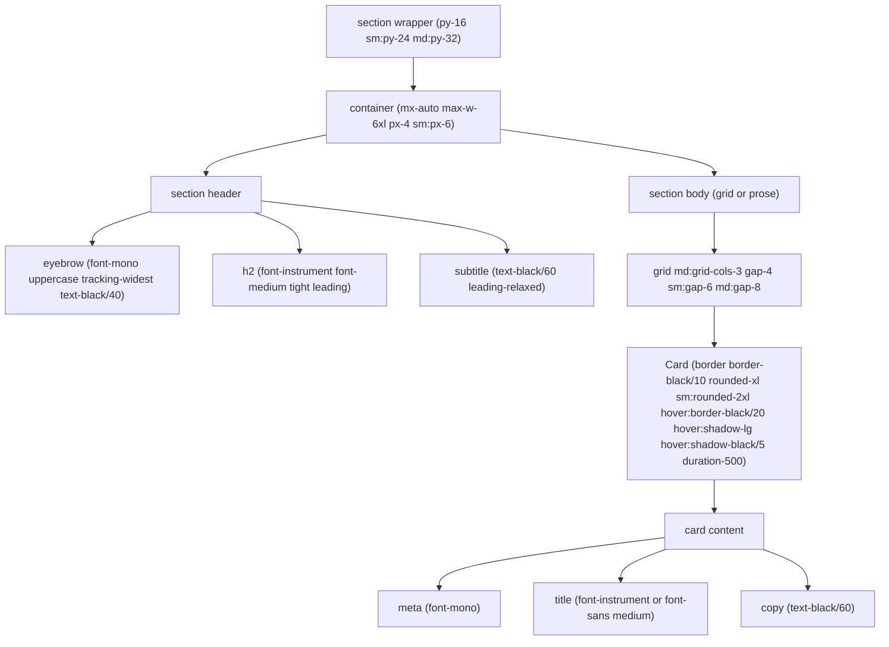
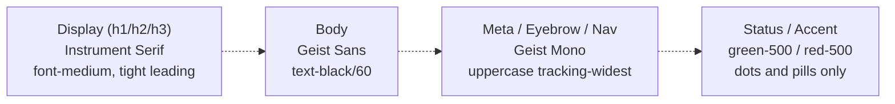
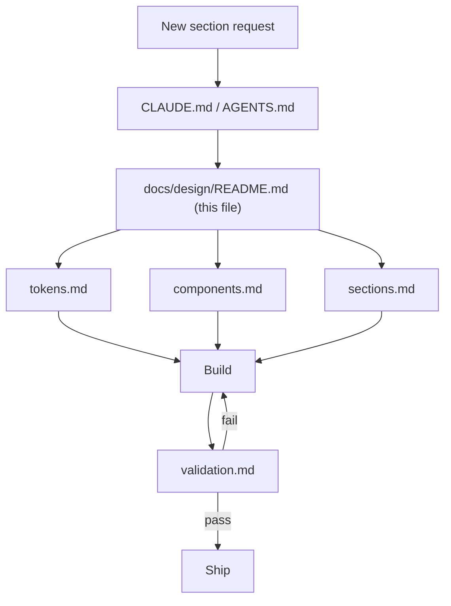

# AI Builders Mexico — Design System

> The single source of truth for how this site looks, feels, and composes. Read this **before** creating, editing, or validating any section, page, or feature.

---

## Mission

Black and white. Serif for display, mono for meta, sans for body. One pill navigation. One container width. Nothing else.

The AI Builders Mexico visual system is an editorial, minimalist identity anchored in the homepage (`/`). Every new surface — section, feature, page — must pass through this system. Campaign pages (`/launch`, `/collab`, `/designwithai`) and product surfaces (`/job-board`) currently carry documented deviations that are being reconciled over time (see [validation.md](./validation.md)).

---

## Golden Rules

1. **Palette is binary.** Black (`#212121`) and white are the only brand colors. Neutrals are black at fractional opacity (`black/5 · /10 · /20 · /40 · /60`). The only allowed accents are status colors (`green-500`, `red-500`) and they are reserved for state, never decoration.
2. **Instrument Serif owns display.** Every heading (`h1`–`h6`) and anything with `.font-instrument` uses Instrument Serif at `font-medium` with tight leading. Do not mix in sans display type.
3. **Geist Mono owns meta.** Eyebrows, labels, timestamps, legal copy, nav items, and microcopy use `font-mono uppercase tracking-widest`. If the text is not body copy and not a heading, it is mono.
4. **Geist Sans is the default.** Unmarked body text is Geist Sans. Opacity levels `text-black/60` (paragraph) and `text-black/40` (muted) carry the hierarchy.
5. **Container is always `max-w-6xl`.** Never override with `max-w-7xl` or full-bleed without a documented reason. Horizontal padding is always `px-4 sm:px-6`.
6. **Vertical rhythm is always `py-16 sm:py-24 md:py-32`.** Sections divide with `border-t border-black/5`. The only exceptions are the first section on a page (no top border) and the sticky dark footer.
7. **The pill navigation is THE nav.** Fixed, centered, `rounded-full`, `backdrop-blur`. Scrolled state deepens the background. There is no alternative nav pattern.
8. **Every semantic landmark section has an `id`.** `#manifesto`, `#events`, `#team`, `#events` — these drive nav anchors and accessibility.
9. **Motion has one duration.** `duration-500` for hover/interaction on cards and images. `duration-300` for nav color shifts. `ease-out` or default. No custom curves.
10. **Copy is Spanish (`es_MX`).** Tone: community-first, direct, professional. This rule overrides all visual concerns — never translate to English to "match" a component.

---

## When To Use What

| I'm about to... | Read first |
|---|---|
| Build a new section or landing page block | [sections.md](./sections.md) → [tokens.md](./tokens.md) → [components.md](./components.md) |
| Add a button, card, eyebrow, nav, or primitive | [components.md](./components.md) |
| Pick colors, fonts, spacing, radii, or animation timing | [tokens.md](./tokens.md) |
| Check whether an existing page follows the system | [validation.md](./validation.md) |
| Understand why `/launch` / `/collab` / `/designwithai` look different | [validation.md § Known Deviations](./validation.md#known-deviations-backlog) |

---

## Table of Contents

- **[tokens.md](./tokens.md)** — Raw values: colors, fonts, type scale, spacing, radii, shadows, motion. Reference when picking a class.
- **[components.md](./components.md)** — Canonical class strings for buttons, cards, pill navigation, eyebrows, status dots, logo sliders, section anchors.
- **[sections.md](./sections.md)** — Five ready-to-copy section templates (hero, content-with-media, grid-of-cards, cta-with-inset, stats-grid) and the heading pattern that appears above each.
- **[validation.md](./validation.md)** — Pre-merge checklist, copy-paste agent scoring prompt, and the reconciliation backlog for campaign/product pages.

---

## Type Hierarchy & Section Anatomy

---

## Agent Workflow

---

## Quick Reference: The Canonical Stack

| Layer | Token | Example |
|---|---|---|
| Section wrapper | `py-16 sm:py-24 md:py-32 bg-white text-black border-t border-black/5` | any light section |
| Container | `mx-auto max-w-6xl px-4 sm:px-6` | inside every section |
| Display heading | `font-instrument font-medium text-3xl sm:text-4xl md:text-5xl` | H2 |
| Eyebrow | `text-[10px] sm:text-xs font-mono uppercase tracking-widest text-black/40` | above H2 |
| Body copy | `text-black/60 leading-relaxed` | paragraph |
| Card | `border border-black/10 rounded-xl sm:rounded-2xl hover:border-black/20 hover:shadow-lg hover:shadow-black/5 transition-all duration-500` | grid item |
| Primary CTA (light bg) | `bg-black text-white rounded-xl` | "Únete" |
| Primary CTA (dark bg) | `bg-white text-black hover:bg-white/90 rounded-xl` | hero CTA |
| Nav CTA | `rounded-full bg-white text-black font-mono text-[10px] sm:text-xs uppercase tracking-widest` | header "Únete" |
| Section anchor | `id="manifesto" \| "events" \| "team"` | every landmark section |

---

## Versioning

- **v1.0** — Extracted from the homepage and section components on April 23, 2026. Canonical reference: [components/hero-section.tsx](../../components/hero-section.tsx), [components/events-section.tsx](../../components/events-section.tsx), [components/team.tsx](../../components/team.tsx), [components/stats.tsx](../../components/stats.tsx), [components/cta-section.tsx](../../components/cta-section.tsx), [components/content-3.tsx](../../components/content-3.tsx), [components/header.tsx](../../components/header.tsx), [components/footer.tsx](../../components/footer.tsx), [app/globals.css](../../app/globals.css), [app/layout.tsx](../../app/layout.tsx).

When this system changes, update the four files in this folder **together** and bump the version above.
