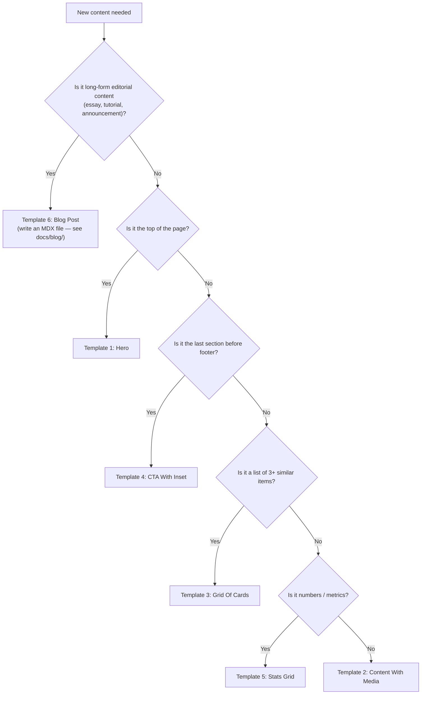

# Section Templates

> Copy-ready section skeletons. Every section on a marketing page should start from one of templates 1–5, then be filled with content. Template 6 covers long-form blog posts, which are authored as MDX files (not hand-rolled section compositions). If your new content doesn't fit any of these, stop and check [validation.md](./validation.md) before inventing a new layout.

Tokens live in [tokens.md](./tokens.md). Primitives (Button, Card, Eyebrow, StatusDot, PillNav) live in [components.md](./components.md).

---

## The Universal Section Wrapper

Every section, regardless of content, wraps in this shell.

### Light (default)

```tsx
<section id="..." className="relative py-16 sm:py-24 md:py-32 overflow-hidden bg-white text-black border-t border-black/5">
  <div className="relative z-10 mx-auto max-w-6xl px-4 sm:px-6">
    {/* content */}
  </div>
</section>
```

### Dark (hero, CTA inset, occasional feature)

```tsx
<section id="..." className="relative py-16 sm:py-24 md:py-32 overflow-hidden bg-[#212121] text-white">
  <div className="relative z-10 mx-auto max-w-6xl px-4 sm:px-6">
    {/* content */}
  </div>
</section>
```

### Rules that apply to both

- `id` required if the section is a nav landmark (see [components.md § 7](./components.md#7-section-anchor)).
- `py-16 sm:py-24 md:py-32` — never less, never more without a documented reason.
- `mx-auto max-w-6xl px-4 sm:px-6` — the only container. Never `max-w-7xl`, never full-bleed.
- `border-t border-black/5` on **light** sections to create vertical rhythm; omit on the first section of a page and on dark sections (dark sections are expected to be visually distinct already).
- `relative overflow-hidden` if the section uses decorative blur orbs, dither, or any absolutely-positioned decor. Otherwise you may drop `overflow-hidden`.

### Optional blur-orb decoration (premium sections)

Place just inside the `<section>` and outside the container `<div>`:

```tsx
<div className="pointer-events-none absolute -top-24 left-1/4 size-72 rounded-full bg-black/[0.02] blur-3xl" />
<div className="pointer-events-none absolute -bottom-24 right-1/4 size-80 rounded-full bg-black/[0.02] blur-3xl" />
```

Reserved for sections that carry a primary CTA (CTA section, events section). Don't stack on every section.

---

## The Universal Section Header

Every section body starts with a header block. The eyebrow is optional, the H2 is required, the subtitle is optional.

```tsx
<header className="flex flex-col items-center text-center space-y-4 sm:space-y-6 max-w-3xl mx-auto">
  {/* Optional eyebrow — plain */}
  <span className="text-[10px] sm:text-xs font-mono uppercase tracking-widest text-black/40">
    El Equipo
  </span>

  {/* Required H2 */}
  <h2 className="text-2xl sm:text-3xl md:text-4xl font-instrument font-medium leading-tight text-balance">
    Los que construyen la comunidad.
  </h2>

  {/* Optional subtitle */}
  <p className="text-base sm:text-lg text-black/60 leading-relaxed max-w-2xl">
    Una pequeña descripción bajo el encabezado.
  </p>
</header>
```

### Variants

- **Left-aligned** (content-with-media pattern): `items-start text-left mx-0`.
- **Pill eyebrow** (CTA pattern): swap the `<span>` for the pill from [components.md § 4.2](./components.md#42-pill-eyebrow). Pill eyebrows almost always pair with a left-aligned header.
- **No eyebrow** (content-3 / stats): drop it. Upcoming events grid does this.

After the header block, add `mt-12 sm:mt-16 md:mt-20` before the body grid/prose.

---

## Template 1 — Hero

**Source of truth:** [components/hero-section.tsx](../../components/hero-section.tsx).

The top-of-page two-column hero: headline + image grid, dither background, fixed to viewport, with a partner logo strip at the bottom (desktop only).

```tsx
<div className="relative">
  <HeroHeader />
  <section className="fixed top-0 left-0 h-[100dvh] w-full flex flex-col pointer-events-none -z-10 bg-[#212121]">
    {/* Dither background */}
    <div className="absolute inset-0 pointer-events-auto">
      <Dither />
    </div>

    {/* Main two-column content */}
    <div className="flex-1 flex items-center w-full pt-16 pb-2 sm:pt-20 sm:pb-4 md:pt-32 md:pb-8 relative z-10 overflow-hidden">
      <div className="mx-auto w-full max-w-6xl px-4 sm:px-6">
        <div className="flex flex-col lg:flex-row lg:items-center justify-between gap-4 sm:gap-6 lg:gap-16">

          {/* Left column: headline + CTAs */}
          <div className="w-full lg:w-1/2 flex flex-col items-center lg:items-start text-center lg:text-left">
            <SplitText
              tag="h1"
              text="La Comunidad de AI en México"
              className="text-balance text-3xl sm:text-4xl md:text-5xl font-medium text-white lg:text-6xl xl:text-7xl leading-[1.1] font-instrument"
              {...splitTextDefaults}
            />
            <p className="mt-3 sm:mt-6 md:mt-8 text-pretty text-sm sm:text-lg md:text-xl text-white/80 max-w-lg">
              {/* lede copy */}
            </p>
            <div className="mt-8 md:mt-10 hidden lg:flex items-center gap-3 pointer-events-auto">
              {/* Primary CTA (1.1) + LinkedIn icon (1.5) */}
            </div>
          </div>

          {/* Right column: 2x2 image grid */}
          <div className="w-full lg:w-1/2 flex flex-col items-center lg:items-end pointer-events-auto">
            <div className="grid grid-cols-2 gap-2 sm:gap-3 md:gap-4 w-full max-w-[360px] sm:max-w-[400px] md:max-w-[500px] lg:max-w-none">
              {/* Four aspect-square tiles, rounded-xl sm:rounded-2xl, grayscale */}
            </div>
            {/* Mobile CTA row (hidden on lg) */}
          </div>

        </div>
      </div>
    </div>

    {/* Partner strip (hidden on mobile) */}
    <div className="relative z-10 pb-3 sm:pb-6 md:pb-8 shrink-0 hidden md:block">
      <InfiniteSlider speedOnHover={20} speed={40} gap={112}>
        {/* Partner logos */}
      </InfiniteSlider>
    </div>
  </section>
</div>
```

### Rules

- Hero is **fixed** (`fixed top-0 left-0 h-[100dvh]`) — the rest of the page scrolls over it.
- Exactly **one** animated headline primitive (`SplitText` or `TextEffect`), never both.
- CTAs appear twice for responsiveness: desktop (`hidden lg:flex`) in the left column, mobile (`flex lg:hidden`) under the image grid.
- Image tiles are always `aspect-square`, `grayscale`, with `hover:scale-105 duration-500`.
- Do not drop the partner strip — if no partners, replace with a single brand line ("Construido en México") in `text-white/70 text-xs`.

### When to use

First section on the homepage and on any campaign page's top fold.

### When NOT to use

Interior sections. Product surfaces (`/job-board/dashboard`). Simple utility pages (`/photos`).

---

## Template 2 — Content With Media

**Source of truth:** [components/content-3.tsx](../../components/content-3.tsx).

The manifesto / about block: a 2-column grid of prose beside a large media panel. Used once per page, typically right after the hero.

```tsx
<section id="manifesto" className="py-16 sm:py-24 md:py-32 bg-white text-black">
  <div className="mx-auto max-w-6xl px-4 sm:px-6 space-y-8 sm:space-y-12 md:space-y-16">

    {/* Two-column prose */}
    <div className="grid md:grid-cols-2 gap-8 sm:gap-12 items-start">
      <h2 className="text-3xl sm:text-4xl md:text-5xl font-medium font-instrument leading-[1.1] text-balance">
        Nuestro manifesto, en tres líneas.
      </h2>
      <div className="space-y-4 text-black/60 text-base sm:text-lg leading-relaxed">
        <p>Primera idea del manifesto.</p>
        <p>Segunda idea — por qué importa.</p>
        <p>Tercera idea — qué hacemos al respecto.</p>
      </div>
    </div>

    {/* Full-width media panel */}
    <div className="relative rounded-2xl sm:rounded-3xl border border-black/10 overflow-hidden h-64 sm:h-80 md:h-[32rem]">
      
      <div className="absolute inset-0 bg-gradient-to-t from-black/20 to-transparent pointer-events-none" />
    </div>

  </div>
</section>
```

### Rules

- **No top border** (`border-t`). This section is meant to flow out of the hero without a visible seam.
- **No eyebrow**. Single H2 is the entry point.
- The media panel is **always** full-width inside the container, `rounded-2xl sm:rounded-3xl`, with the `grayscale hover:grayscale-0` treatment.
- Gradient overlay is optional; add `from-black/20` when the image would otherwise clash with the next section's top edge.

### When to use

Manifesto, About, mission statements — prose that needs breathing room next to a single strong image.

### When NOT to use

Lists of items (use Template 3). Narrow marketing features (don't force a 2-column grid on three bullet points).

---

## Template 3 — Grid Of Cards

**Source of truth:** [components/events-section.tsx](../../components/events-section.tsx), [components/team.tsx](../../components/team.tsx).

The most-used template: a section header over a responsive card grid. Use for events, team members, testimonials, case studies, blog previews.

```tsx
<section id="team" className="py-16 sm:py-24 md:py-32 bg-white text-black border-t border-black/5">
  <div className="mx-auto max-w-6xl px-4 sm:px-6">

    {/* Header */}
    <header className="flex flex-col items-center text-center space-y-3 sm:space-y-4 max-w-3xl mx-auto">
      <span className="text-[10px] sm:text-xs font-mono uppercase tracking-widest text-black/40">
        El Equipo
      </span>
      <h2 className="text-2xl sm:text-3xl md:text-4xl font-instrument font-medium leading-tight">
        Los que construyen la comunidad.
      </h2>
    </header>

    {/* Grid */}
    <ul className="mt-12 sm:mt-16 md:mt-20 grid gap-4 sm:gap-6 md:gap-8 md:grid-cols-2 lg:grid-cols-3">
      {items.map((item, i) => (
        <li
          key={item.id}
          className="group relative border border-black/10 rounded-xl sm:rounded-2xl bg-white hover:border-black/20 hover:shadow-lg hover:shadow-black/5 transition-all duration-500 p-4 sm:p-5"
        >
          {/* Optional desktop-only decorative index */}
          <span className="hidden md:block absolute top-4 right-4 text-xs font-mono text-black/20">
            / {String(i + 1).padStart(2, "0")}
          </span>

          {/* Card content */}
          <h3 className="mt-4 text-lg sm:text-xl font-medium">{item.title}</h3>
          <p className="mt-2 text-sm text-black/60 leading-relaxed">{item.description}</p>
        </li>
      ))}
    </ul>

  </div>
</section>
```

### Rules

- **Grid column rules:**
  - Default team/testimonial grid: `md:grid-cols-2 lg:grid-cols-3`.
  - 4-up case study grid: `md:grid-cols-2 lg:grid-cols-4` — rare, use only for logo-heavy lists.
  - Events grid: `md:grid-cols-2 lg:grid-cols-3`, but event cards are taller — increase `gap-6 sm:gap-8` accordingly.
- **Card is the canonical card primitive** (see [components.md § 2](./components.md#2-card)). Do not deviate.
- **`group` on the card** enables nested `group-hover:*` on child elements (e.g. scale an arrow, reveal overlay).
- **Index badge is optional and desktop-only** (`hidden md:block`). Use `text-black/20 font-mono` — never darker.
- Card titles use `font-medium` (Instrument Serif auto-applied) and sit on a line-height-tight cadence.

### Card body variations

| Kind | Body |
|---|---|
| Person | Avatar (rounded-xl, grayscale), Name (Instrument), Role (mono uppercase), optional Link. |
| Event | Month+Day block (mono month + Instrument day), Title, Location, Status dot + label, Button. |
| Stat | Icon chip (`group-hover:bg-black group-hover:text-white`), Value (Instrument display-md), Label (mono). |
| Content teaser | Title (Instrument), Excerpt (text-black/60), mono meta row, Link CTA. |

### When to use

Anything pluralized: events, team, testimonials, case studies, job listings (in the canonical mode — see job-board note in [validation.md](./validation.md)).

### When NOT to use

Single-item highlights (use Template 2 or a bespoke feature). Photo galleries (use a masonry or marquee — not the card grid).

---

## Template 4 — CTA With Inset

**Source of truth:** [components/cta-section.tsx](../../components/cta-section.tsx).

A two-column CTA section: left column is brand copy on the light section background, right column is a dark inset card with the newsletter form and social CTAs. This is the "close" of the page before the footer.

```tsx
<section className="relative py-16 sm:py-24 md:py-32 overflow-hidden bg-white text-black border-t border-black/5">
  {/* Optional blur orbs */}
  <div className="pointer-events-none absolute -top-24 left-1/4 size-72 rounded-full bg-black/[0.02] blur-3xl" />
  <div className="pointer-events-none absolute -bottom-24 right-1/4 size-80 rounded-full bg-black/[0.02] blur-3xl" />

  <div className="relative z-10 mx-auto max-w-6xl px-4 sm:px-6">
    <div className="grid lg:grid-cols-2 gap-8 sm:gap-12 items-center">

      {/* Left column: pill eyebrow → headline → subtitle → secondary link */}
      <div className="flex flex-col items-start text-left space-y-5 sm:space-y-6">
        <div className="inline-flex items-center gap-2 rounded-full border border-black/5 bg-black/[0.02] px-3 py-1.5">
          <span className="relative flex size-1.5">
            <span className="absolute inline-flex h-full w-full animate-ping rounded-full bg-black/40 opacity-75" />
            <span className="relative inline-flex size-1.5 rounded-full bg-black" />
          </span>
          <span className="text-[9px] sm:text-[10px] font-mono uppercase tracking-widest font-bold text-black/60">
            Comunidad Activa
          </span>
        </div>
        <h2 className="text-3xl sm:text-4xl md:text-5xl lg:text-6xl font-instrument font-medium leading-[1.1] text-balance">
          Construye con nosotros.
        </h2>
        <p className="text-base sm:text-lg text-black/60 leading-relaxed max-w-md">
          {/* subtitle */}
        </p>
      </div>

      {/* Right column: dark inset card */}
      <div className="relative rounded-2xl sm:rounded-3xl bg-black text-white p-6 sm:p-10 overflow-hidden">
        {/* Dot-grid decoration */}
        <div className="absolute inset-0 opacity-10 pointer-events-none"
             style={{ backgroundImage: "radial-gradient(white 1px, transparent 1px)", backgroundSize: "16px 16px" }} />

        <div className="relative z-10 space-y-6">
          <p className="text-xs font-mono uppercase tracking-widest text-white/60">Newsletter</p>
          <h3 className="text-xl sm:text-2xl font-instrument font-medium">Recibe updates semanales.</h3>
          <form className="flex gap-2">
            <input
              type="email"
              placeholder="tu@email.com"
              className="flex-1 rounded-xl border border-white/10 bg-white/[0.05] px-4 py-3 text-sm text-white placeholder:text-white/40 focus:border-white/30 focus:outline-none transition-colors"
            />
            <Button className="rounded-xl bg-white text-black hover:bg-white/90 px-6">
              Suscribirme
            </Button>
          </form>
          <p className="text-[10px] font-mono uppercase tracking-widest text-white/30">
            Sin spam. Cancela cuando quieras.
          </p>
        </div>
      </div>

    </div>
  </div>
</section>
```

### Rules

- **The dark inset card is always `bg-black` + `text-white`** with `rounded-2xl sm:rounded-3xl`.
- Dot-grid overlay at `opacity-10` is optional but the standard decorative treatment.
- Inside the card: mono kicker → Instrument sub-headline → form/CTA → mono legal footnote.
- Outer section has **no `id`** — this is not a navigable landmark, it's a closing CTA.

### When to use

The last section of a page before the footer. Newsletter signup. "Join the community" close-out. Final pitch on a campaign page.

### When NOT to use

Mid-page. If you need a mid-page CTA, use a single full-width dark inset card (no two-column) or a button inside a regular section.

---

## Template 5 — Stats Grid

**Source of truth:** [components/stats.tsx](../../components/stats.tsx).

A compact, centered single-headline section over a 3-column stats grid. Optional partner logo strip on mobile.

```tsx
<section className="relative py-12 sm:py-16 md:py-32 bg-white text-black border-t border-black/5 overflow-hidden">
  <div className="relative z-10 mx-auto max-w-6xl px-4 sm:px-6 space-y-8 sm:space-y-10 md:space-y-20">

    {/* Centered single headline */}
    <h2 className="text-2xl sm:text-3xl lg:text-5xl font-instrument font-medium leading-tight text-center max-w-2xl mx-auto">
      La comunidad, en números.
    </h2>

    {/* Stats grid */}
    <div className="grid gap-4 sm:gap-6 md:grid-cols-3">
      {stats.map((s) => (
        <Card
          key={s.label}
          className="group border-black/10 rounded-xl sm:rounded-2xl hover:border-black/20 hover:shadow-lg hover:shadow-black/5 transition-all duration-500"
        >
          <CardContent className="p-6 sm:p-8 flex flex-col items-start gap-4">
            <span className="inline-flex items-center justify-center size-10 rounded-full bg-black/[0.03] text-black/60 group-hover:bg-black group-hover:text-white transition-all duration-500">
              <s.icon className="size-5" />
            </span>
            <div>
              <p className="text-3xl sm:text-4xl lg:text-5xl font-instrument font-medium">{s.value}</p>
              <p className="mt-1 text-xs font-mono uppercase tracking-widest text-black/40">{s.label}</p>
            </div>
          </CardContent>
        </Card>
      ))}
    </div>

    {/* Optional: mobile partner strip */}
    <div className="md:hidden">
      <p className="text-xs font-mono uppercase tracking-widest text-black/40 mb-4">Partners</p>
      <InfiniteSlider speedOnHover={20} speed={40} gap={64}>
        {/* logos with `invert` class */}
      </InfiniteSlider>
    </div>

  </div>
</section>
```

### Rules

- **Vertical rhythm is compact** — `py-12 sm:py-16 md:py-32` (less than the default `py-16 sm:py-24 md:py-32`). This section follows a heavier content section and should feel like a breather.
- **Headline is centered**, single line of Instrument Serif. No eyebrow, no subtitle.
- **Icon chip hover inverts to solid black** — this is the signature hover; preserve it.
- **Stats values use Instrument Serif display-md** (`text-3xl sm:text-4xl lg:text-5xl font-instrument font-medium`).
- **Labels are mono** (`text-xs font-mono uppercase tracking-widest text-black/40`).
- Partner strip is mobile-only (`md:hidden`). Desktop visitors see partners in the hero.

### When to use

Community metrics, program outcomes, achievements. Any small set of hard numbers (2–4 items).

### When NOT to use

Narrative content (use Template 2). More than 4 items (use Template 3 with smaller cards).

---

## Template 6 — Blog Post

**Source of truth:** [components/blog/post-shell.tsx](../../components/blog/post-shell.tsx) (layout shell) + [content/blog/*.mdx](../../content/blog/) (authored content) + [docs/blog/](../blog/) (authoring guide).

Blog posts are **not** a section template you compose inside a marketing page — they are a dedicated page type under `/blog/<slug>` with its own approved deviations from the core design system. This template exists so you know when (and how) to use that path vs. the five marketing-section templates above.

**TL;DR shape:**

- A post lives as a single `.mdx` file in [`content/blog/`](../../content/blog/). The file's frontmatter + body are rendered by [`PostShell`](../../components/blog/post-shell.tsx), which emits the `<h1>` + meta + mobile TOC + sticky desktop TOC + article column + back link.
- Authoring uses the MDX system documented in [docs/blog/](../blog/). Do **not** hand-roll a new `.tsx` route under `app/(blog)/<slug>/`.

```mdx
---
title: "Título del post"
description: "Una o dos frases que hacen que valga la pena abrirlo."
date: "2026-04-23"
readTime: "5 min"
tocItems:
  - { id: "intro", label: "Introducción" }
  - { id: "conclusion", label: "Conclusión" }
---

Párrafo de apertura.

<SectionTitle id="intro">Introducción</SectionTitle>

Plain markdown, con componentes documentados como `<Callout>`, `<StepList>`, `<CheckList>`
cuando el patrón se repite.

<SectionTitle id="conclusion">Conclusión</SectionTitle>

Cierre breve.
```

Full authoring reference:

- [docs/blog/CONTRIBUTING.md](../blog/CONTRIBUTING.md) — 5-step flow, golden rules, pitfalls.
- [docs/blog/frontmatter.md](../blog/frontmatter.md) — every YAML field.
- [docs/blog/components.md](../blog/components.md) — every MDX component and when to use it.
- [docs/blog/_template.mdx](../blog/_template.mdx) — copy-and-rename starter.

### Approved deviations from the core system

Blog posts are a **documented variant** (see [validation.md § Known Deviations](./validation.md#known-deviations-backlog)) — the deviations below are intentional and should not be "fixed" to match the marketing-page templates.

- **Scoped theme toggle.** `/blog/*` uses a dedicated light/dark theme via `useBlogTheme()` in [`app/(blog)/layout.tsx`](../../app/(blog)/layout.tsx), separate from the global `next-themes`. This is the only place on the site with a user-facing theme switcher.
- **Catppuccin palette for reading UI.** Post bodies, callouts, code blocks, and the terminal component use Catppuccin Mocha (dark) / Latte (light) for prose, accent, and code-surface colors. Black/white is still the brand anchor (header, nav, hero CTAs), but long-form reading benefits from a slightly warmer, higher-contrast palette.
- **Reading-width column.** The article column sits inside `max-w-6xl` but its prose is further constrained by the sticky TOC on the right rail. Don't apply marketing-section grids inside a post.
- **Instrument Serif for `<SectionTitle>`.** Same display type as the rest of the site; no new type family is introduced.

### Rules that still apply

- **Pill navigation** (the blog has its own `BlogHeader` in [`app/(blog)/layout.tsx`](../../app/(blog)/layout.tsx) with a matching pill shape).
- **Container is still `max-w-6xl`** — the TOC + article column fit inside it.
- **Typography roles are unchanged** — Instrument Serif for display, Geist Mono for meta (date, readTime, TOC labels, eyebrows), Geist Sans for body.
- **Spanish copy** (`es_MX`) per the global rule.

### When to use

You're publishing long-form content: essays, tutorials, announcements, retrospectives. Anything with a byline, a date, and more than ~400 words of body copy.

### When NOT to use

- A marketing-page section with 2–3 paragraphs and a CTA → use Template 2 (Content With Media) or Template 4 (CTA With Inset).
- A product changelog or release note → open a new section on an existing page; blog posts are for editorial content, not release notes.
- A case study with heavy visual / interactive layout → discuss in a PR before shipping; may warrant its own dedicated route under `app/<slug>/`, not the blog.

---

## Choosing a Template



If you can't answer any question with "yes", you probably don't need a new section — rework an existing one.

---

## Cross-links

- Raw values: [tokens.md](./tokens.md).
- Primitive components assembled in these templates: [components.md](./components.md).
- How to validate a built section against these templates: [validation.md](./validation.md).
